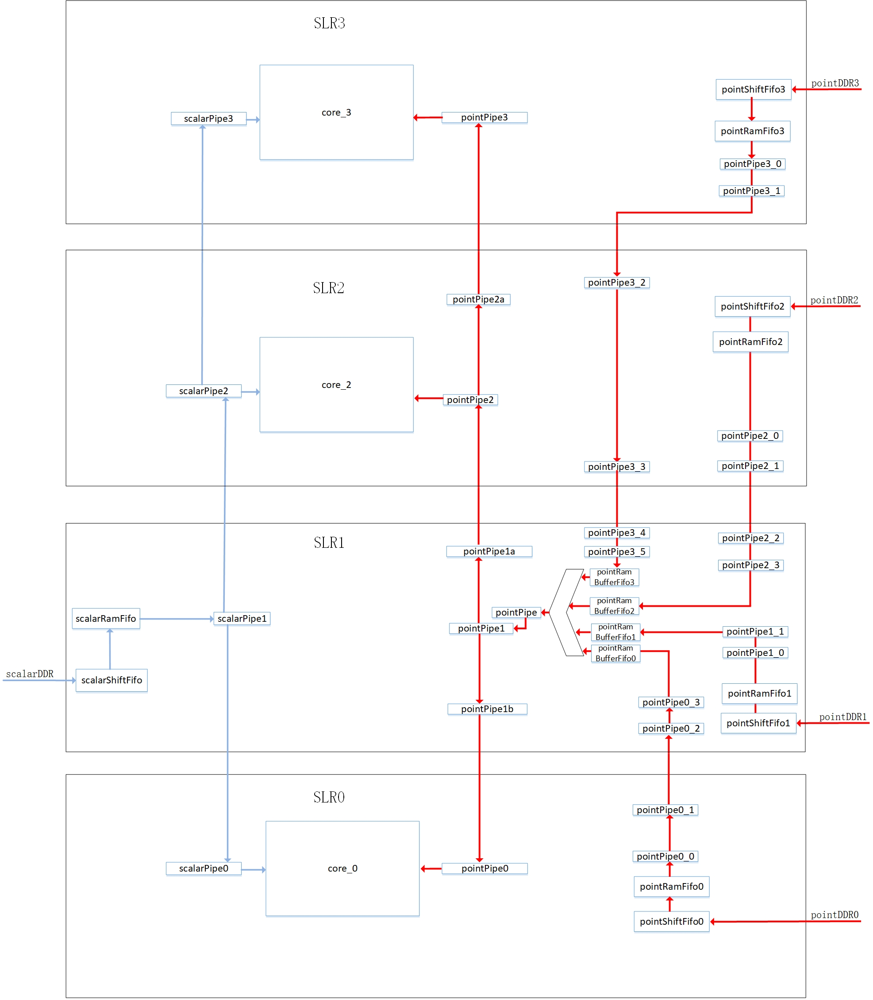
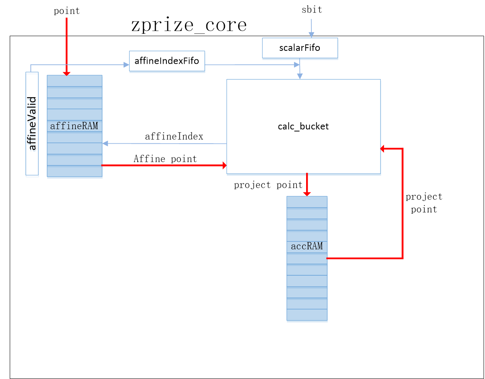
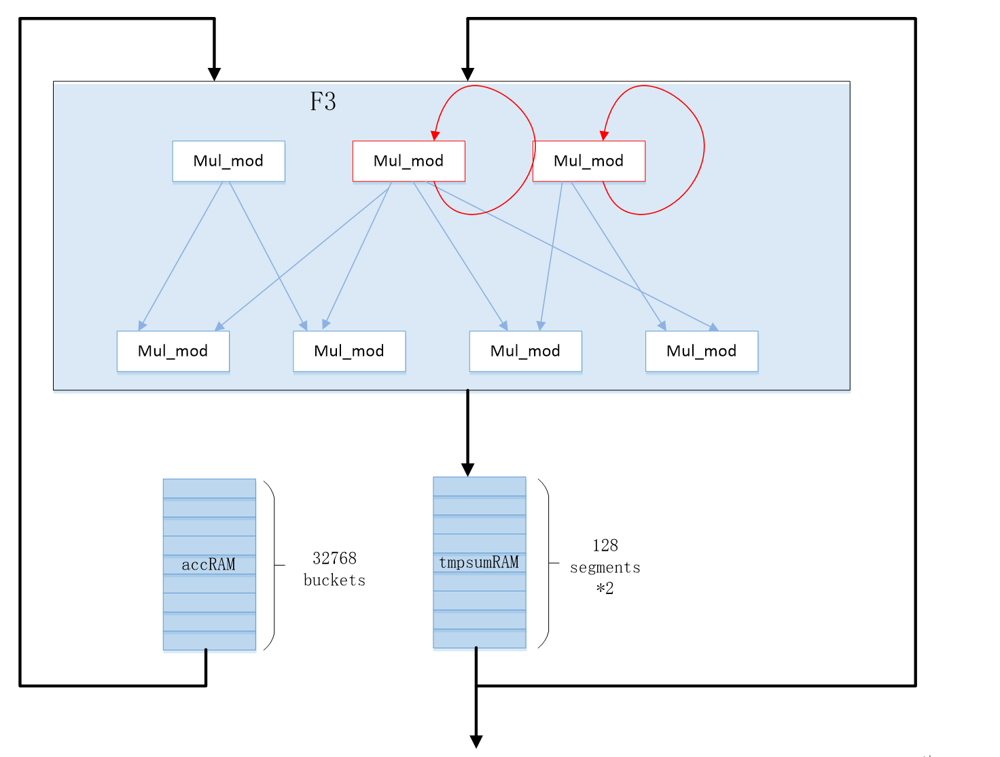
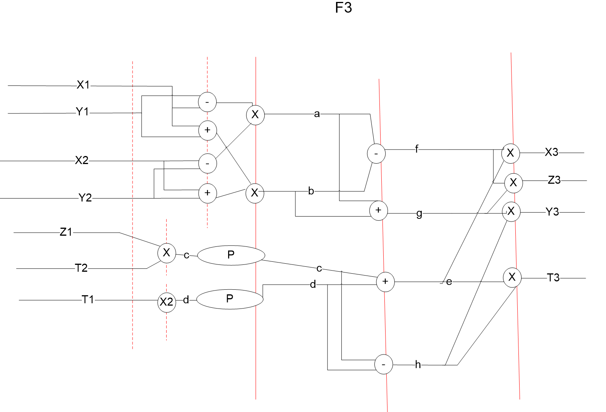
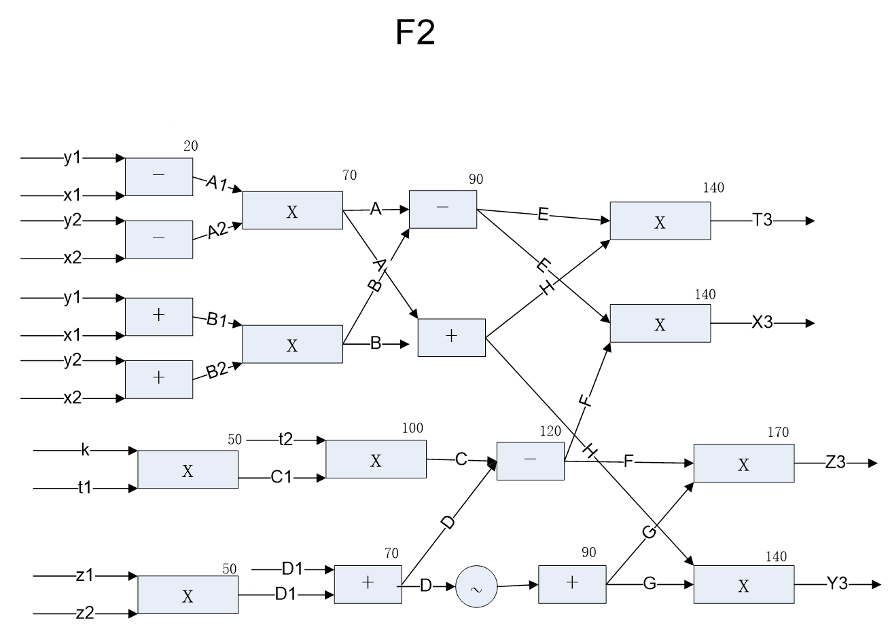
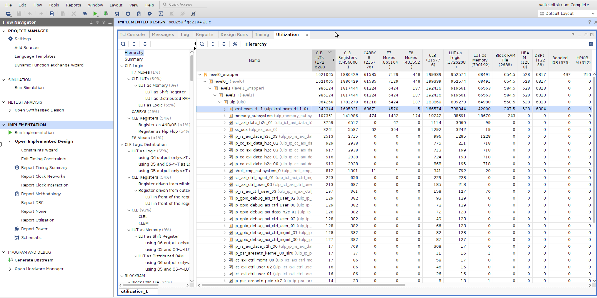
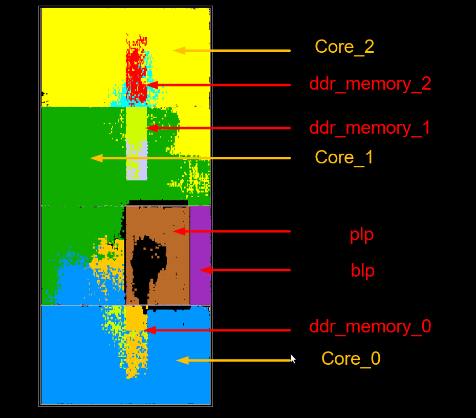
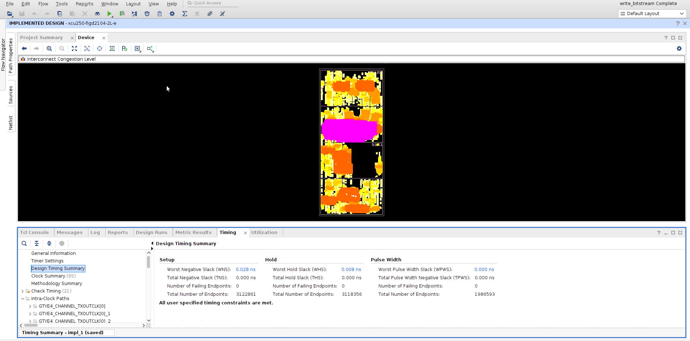

> # SuperScalar - ZPrize-MSM FPGA Design Doc

[toc]

## 1. The Goal of Zprize

- **Objective**: The aim is to achieve acceleration in performing 2^24 MSM computations using an FPGA.
- **Scope Limitation**: Due to time constraints, we are currently focusing on supporting MSM calculations for BLS377 only.
- **MSM Computation Stages**:

  - **Calc_Bucket**: Within each group, every point 'P' is added to its corresponding bucket: $B = \sum P_i$. This step aggregates all points within a group into their respective buckets.
  - **Calc_Group**: For each group, all the buckets are multiplied by their indices and summed together: $G = \sum i*B_i$. This stage represents the accumulation of weighted buckets within a group.
  - **Calc_Aggregation**: Finally, across all groups, the results are further aggregated where each group result is multiplied by $2^{i*S}$ before being summed up: $\sum K_i*P_i = \sum 2^{i*S}*G_i$. This final step combines the results from different groups to complete the MSM calculation process.

The computation time excludes the preparation and transfer of point data to the FPGA but includes the preparation and transfer of scalar data to the FPGA.

Within our design, there are two types of point addition operations:

1. The addition of two points expressed in projective coordinates, which is referred to as F2 in our scheme.
2. The addition of a point in affine coordinates to a point in projective coordinates, which is designated as F3 in our design.

In this context, the calc_bucket procedure utilizes F3 as the adder function, whereas the calc_group and calc_aggregation stages employ F2 as the adder for their operations.

## 2. Performance Estimation

### 2.1 The number of adders

- Assuming each group has s bits, there would be $\frac{253}{s}$ groups.
- For **Calc_Bucket**, the number of required F3 adders is: $2^{24} * \frac{253}{s}$
- For **Calc_Group**, the number of required F2 adders is: $2 * 2^{s} * \frac{253}{s}$
- For **Calc_Aggregation**, the number of adders needed can be neglected as this part is computed by the CPU.

### 2.2 Based on the given performance considerations and design requirements:

Estimating the total computational load for F2 and F3 operations at different S-bit widths, considering there are 2^24^ points:

- With the assumption that one F2 operation is equivalent to two F3 operations in terms of computational complexity, we normalize the results to the count of F3 operations. Each core performs one F3 operation per cycle.
- The analysis shows that when s = 17, the overall computational requirement reaches its minimum. However, due to insufficient on-chip RAM capacity, we opt for s = 16 instead.
- By utilizing signed bits, we halve the number of buckets, thereby also reducing the necessary on-chip RAM units by half.
- With these settings, it takes 272,629,696 cycles to compute one MSM. Given an operating frequency of 250 MHz, the time for one core to compute one MSM is 272,629,696 / 250M = 1.09 seconds.
- In practice, our design incorporates three cores. Therefore, theoretically, it would take 1.09 * 4 / 3 = 1.45 seconds to compute four MSMs in parallel. This estimation does not factor in scalar transfer times or any inefficiencies arising from the fact that three cores processing four MSMs would involve dealing with 16 * 4 groups that might not divide evenly.

| group_num=127, s=2 | result=2130707956 | f3=2130706432 | f2=762      |
| ------------------ | ----------------- | ------------- | ----------- |
| group_num=85, s=3  | result=1426065740 | f3=1426063360 | f2=1190     |
| group_num=64, s=4  | result=1073745664 | f3=1073741824 | f2=1920     |
| group_num=51, s=5  | result=855644340  | f3=855638016  | f2=3162     |
| group_num=43, s=6  | result=721431124  | f3=721420288  | f2=5418     |
| group_num=37, s=7  | result=620775788  | f3=620756992  | f2=9398     |
| group_num=32, s=8  | result=536903552  | f3=536870912  | f2=16320    |
| group_num=29, s=9  | result=486598540  | f3=486539264  | f2=29638    |
| group_num=26, s=10 | result=436314008  | f3=436207616  | f2=53196    |
| group_num=23, s=11 | result=386064292  | f3=385875968  | f2=94162    |
| group_num=22, s=12 | result=369459112  | f3=369098752  | f2=180180   |
| group_num=20, s=13 | result=336199600  | f3=335544320  | f2=327640   |
| group_num=19, s=14 | result=320012212  | f3=318767104  | f2=622554   |
| group_num=17, s=15 | result=287440828  | f3=285212672  | f2=1114078  |
| group_num=16, s=16 | result=272629696  | f3=268435456  | f2=2097120  |
| group_num=15, s=17 | result=259522500  | f3=251658240  | f2=3932130  |
| group_num=15, s=18 | result=267386820  | f3=251658240  | f2=7864290  |
| group_num=14, s=19 | result=264241096  | f3=234881024  | f2=14680036 |

### 2.3 S-bit=16

Due to the later mentioned issue regarding DDR bandwidth constraints, the number of buckets cannot be too large; hence, S-bit is set to 16.

With sbit equal to 16, there are 16 groups, and each group contains 32,768 buckets (as the use of signed bits allows for halving the number of buckets).

- The number of adders required for **Calc_Bucket** is $2^{24} * 16$.
- The number of adders required for **Calc_Group** is $2 * 32,768 * 16$.

The ratio between the multiplicities of adders needed for these two stages is approximately 512:1.

### 2.4 The increase in the number of adders leads to potential problems with insufficient memory bandwidth.

#### 2.4.1 memory bandwidth

Scalar bandwidth is relatively low and does not require extensive discussion here. Points are stored in DDR memory and sequentially read out to be used by the adders. Each time an adder performs a calculation, it requires reading a point. The point size is 144 bytes, and assuming an adder frequency of 300 MHz, the required memory read bandwidth is 144B * 300M = 43.2GB/s.

The U250 device features 4 DDR channels, each with a theoretical bandwidth of 16GB/s, for a combined total of 64GB/s.

Thus, the actual available memory bandwidth of 64GB/s meets the algorithm's requirement of 43.2GB/s.

Our design involves employing 3 adders. With 3 adders, the required memory bandwidth would be 43.2 * 3 = 129.6GB/s, which exceeds the actual memory bandwidth of 64GB/s.

To address this issue, our proposed solution is to fetch one point and calculate it concurrently in all 3 groups, with each adder dedicated to one group. Both points and scalars are fetched simultaneously and utilized in one go, effectively saving 3 times the bandwidth. Hence, the actual memory bandwidth usage remains at 43.2GB/s.

Since each MSM calculation consists of 16 groups, and 16 is not divisible by 3 exactly, we will combine the groups from the next MSM calculation with the remaining group from the previous MSM calculation to run them together, minimizing idle time for the adders.

### 2.5 Execution of Calc_group on FPGA

When we choose a larger S-bit value, the number of F2 operations significantly increases, making it imperative that the calc_group stage be executed on the FPGA.

### 2.6 Whether Calc_group is implemented using fully pipelined adders or through mulmod

We have repurposed the F3 adders from calc_bucket for F2 operations in calc_group, resulting in minimal performance loss. Since the ratio of adders between calc_bucket and calc_group stages is 512:1, reusing the adders from calc_bucket for calc_group incurs only a 1/512 reduction in performance initially.

However, considering that it actually takes two F3 adder calculations in calc_bucket to equate to one F2 adder operation in calc_group, the practical loss in performance is halved, becoming 1/256. This strategic reuse of hardware resources allows us to maintain a high level of computational efficiency while adapting to the varying needs of different stages in the MSM computation process.

### 2.7 Detailed Implementation of zprize_msm

The overall architecture is depicted in 2.8, noting that the three rectangles symbolize three identical cores, each capable of independently computing the calc_bucket and calc_group operations within a single group. Points originate from three pointDDR channels, first passing through a pointShiftFifo to convert the DDR's 512-bit width to a 1152-bit width for each point. These points are then sequentially output via a MUX after passing through the three pointDDR channels, shared among the three cores.

#### 2.7.1 Storage Format of Points in DDR

Points are arranged sequentially across four DDR channels. Specifically, the distribution is as follows:

- Channel 0 contains points 0, 4, and 8, and so forth.
- Channel 1 stores points 1, 5, and 9.
- Channel 2 houses points 2, 6, and 10.
- Channel 3 holds points 3, 7, and 11.

#### 2.7.2 Storage Format of Scalars in DDR

Scalars come from a single scalarDDR channel. The data structure of scalars in DDR is as follows:
Starting with the 0th MSM:

- The slice values of the 0th scalar for groups 0 to 2 are concatenated together
- followed by the sbit concatenation for the 1st scalar's groups 0 to 2
- and so forth until the last scalar's groups 0 to 2.
- To optimize alignment in memory, sbits from three groups are merged together and aligned to 64-bit boundaries.

Subsequently, the sbit concatenation continues for the 0th scalar's groups 3 to 5, and so on... This pattern concludes with the sbit concatenation for the last scalar's groups 12 to 15.

In this manner, the 15th group of scalars for the 0th MSM is merged with the 0 to 1 groups of scalars from the 1st MSM and so on. Consequently, three groups worth of sbit data along with their corresponding point data appear at the interface of the core module. Inside the core module, three calc_bucket modules process these points and scalars accordingly.

### 2.8 FPGA Layout of zprize_msm on U250

The Xilinx U250 FPGA features four SLRs (Super Logic Regions). Ideally, one core and one pointDDR channel could be placed in each SLR. However, due to the use of the Vitis design flow, when Vitis utilizes the U250, the right half of SLR1 is reserved for system functions, rendering it unavailable for our design. Thus, we are able to accommodate only 3 cores and 4 pointDDR channels.

SLR1's left half is utilized to house the logic for one scalarDDR channel, the MUX logic for the 4 pointDDR channels, and some additional logic that couldn't fit in the other three SLRs.

Each core houses adders composed of seven modular multipliers. Due to layout and routing resource constraints within the SLRs, one modular multiplier from core0 is placed in SLR1, two modular multipliers from core2 are placed in SLR1, and one modular multiplier from core3 is placed in SLR2. As a result, SLR0, SLR2, and SLR3 each contain six modular multipliers, while SLR1 contains three.

There are over 20,000 inter-SLR routing IOs, providing ample connections for modular multipliers spanning across SLR boundaries. When points and scalars cross SLR boundaries, they are buffered using pointPipe and scalarPoint to manage timing effectively.

All modules in the diagram below have been assigned to specific SLRs according to the constraints defined in the xdc file.

### 2.9 Structure of zprize_core

A single point is simultaneously written into all three cores, while a scalar is split into three sbit parts and written into the respective sbit sections of each core. Matching points and scalars must be written simultaneously, necessitating that all three cores have empty slots available to write them in unison.

Given that the routing of points and scalars crosses multiple SLRs, timing issues may arise. To manage these timing challenges, specialized pipe modules are employed to synchronize data transmission. These pipe modules only feature a valid signal and do not have a ready signal, thus avoiding propagation delays associated with ready signals. Each core includes a large storage area to temporarily hold points and scalars, and provides a creditOK signal back to the source of the pipe. As long as credits are sufficient, data can propagate through all levels of the pipe from source to destination. It is important to note that the creditOK signal also needs to be synchronized across SLRs using pipes.

An affineRAM module is used to temporarily store incoming point data, while a scalarFifo module is used to buffer the incoming sbit portions of the scalar.

The calc_bucket module performs the calc_bucket calculations and also integrates a sub-module for calc_group computations. The accRAM stores the accumulated sums of the 32,768 buckets in a single group, and feeds these results as input to the calc_group submodule.

Therefore, the total capacity of the accRAM is 3 * 32,768 entries, with each entry being 1536 bits, amounting to a total capacity of 150Mb. Considering that the U250 FPGA offers 270Mb of UltraRAM (URAM), this capacity meets the design's requirements.

### 2.10 Design of calc_bucket

The design of the calc_bucket primarily focuses on addressing conflicts between points awaiting computation and those already under computation within the same bucket. Given the substantial number of points (2^24) in the zprize-msm, the number of buckets is also quite large, leading to a latency for F3 operations (200) that is much smaller relative to the total number of buckets (32768). This disparity reduces the likelihood of conflict between points waiting to be computed and those actively being processed within the same bucket.

To manage this, a record is kept of all points undergoing F3 computations in an outstanding buffer. Each point awaiting computation is compared against the buckets of all points in the outstanding buffer. If no conflict arises, the point is then sent for addition calculations.

The zprize_new_bucketControl module plays a critical role in detecting and managing these conflicts. It achieves this by storing points with detected conflicts in a waitBuffer, ensuring that these points do not block subsequent points. The design is optimized to send at least one point per cycle to the adder for computation. Points held in the waitBuffer await resolution of their conflicts and are subsequently forwarded to the adder for calculation once the bucket they belong to is no longer occupied by another point in the computation pipeline.

### 2.11 Design of calc_group

Algorithm Principle

Let's illustrate the principle with n=5 as an example.

For G = b1 + 2b2 + 3b3 + 4b4 + 5b5, where b1, b2, b3, b4, and b5 are known values, the calculation can be done iteratively using f2 point additions. The steps are as follows:

1. **Initialization**

   - `sum = 0`
   - `tmp = 0`
2. Perform point additions in reverse order:

   - `sum = sum + tmp` → `0`
   - `tmp = b5 + tmp` → `(b5)`
   - `sum = sum + tmp` → `(b5)`
   - `tmp = b4 + tmp` → `(b5+b4)`
   - `sum = sum + tmp` → `(b5) + (b5+b4)`
   - `tmp = b3 + tmp` → `(b5+b4+b3)`
   - `sum = sum + tmp` → `(b5) + (b5+b4) + (b5+b4+b3)`
   - `tmp = b2 + tmp` → `(b5+b4+b3+b2)`
   - `sum = sum + tmp` → `(b5) + (b5+b4) + (b5+b4+b3) + (b5+b4+b3+b2)`
   - `tmp = b1 + tmp` → `(b5+b4+b3+b2+b1)`
   - `sum = sum + tmp` → `(b5) + (b5+b4) + (b5+b4+b3) + (b5+b4+b3+b2)+ (b5+b4+b3+b2+b1)`

In summary:

- G = b1 + 2b2 + 3b3 + 4b4 + 5b5
- G = (b5) + (b5+b4) + (b5+b4+b3) + (b5+b4+b3+b2) + (b5+b4+b3+b2+b1)

By iterating this process five times, we can obtain the final value of G.

In the calc_group design, this iterative approach is adapted to perform the weighted sum of buckets in an FPGA environment, where each multiplication by the index (1 to n) is replaced with a sequence of point additions, exploiting the parallel nature of FPGA circuits to accelerate the computation.

### 2.12 Elimination of Bubbles in Fully-Pipelined calc_group

The latency of a fully-pipelined adder is estimated to be around 200 clock cycles. To ensure that the adder does not remain idle during this period, the algorithm design must provide at least 200 parallel instances of data unrelated to the current computation.

To hide this latency, considering that the calculation of `tmp` and `sum` can occur in parallel, we require at least 238/2 = 119 levels of parallelism.

These 119 levels of parallelism are achieved by dividing the 32,768 buckets within a group into 128 segments. The segments can be computed in parallel with each other. Within each segment, there are 256 groups computed serially.

The task of combining the results from these 128 segments into a final result is handled by the CPU. Thus, the final aggregation involves 128 sets of data multiplied by 16 groups, which equals 2,716 data elements. Each data element is 192 bytes, leading to a total of 393 kilobytes of data.

Moreover, since 2^24 clock cycles constitute a lengthy duration, it is unnecessary to consider starting the computation of a new group before the completion of the previous one. Instead, the pipeline can be allowed to drain completely before ending the current batch of computations without affecting performance. This way, the pipeline remains fully utilized throughout the entire calculation process.

#### 2.12.1 Parallel Execution

The instructions `sum = sum + tmp` and `tmp = bn + tmp` can be executed independently and in parallel for each group, thereby providing two levels of parallelism per group.

Assuming the 32,768 buckets are divided into 128 segments, each containing 256 groups, the segments operate in parallel, whereas the groups within each segment execute serially. The two instructions within each group are indeed parallelized, giving a total parallelism of 256.

Here's how the parallel execution is structured:

- At instruction 0: Compute the `sum` for the 0th segment.
- At instruction 1: Compute the `tmp` for the 0th segment.
- At instruction 2: Compute the `sum` for the 1st segment.
- At instruction 3: Compute the `tmp` for the 1st segment.
- ...
- At instruction 254: Compute the `sum` for the 127th segment.
- At instruction 255: Compute the `tmp` for the 127th segment.

After 256 clock cycles, the `sum` result for the 0th segment will be available. The computation can then proceed to the second group in each segment...

It's important to note that following this pattern, after the loop completes, the `sum` result for the last group in each segment misses one iteration of `sum = sum + tmp`. This final accumulation step is handled by the CPU to produce the complete and accurate result.

#### 2.12.2 Specific Design

The calc_group input comes from the accRAM, and the results of `sum` and `tmp` registers are stored in the tmpsumRAM with a depth of 128 segments * 2.

Considering that F3 uses 7 mul_mods, and F2 requires 9 mul_mods, with 2 extra mul_mods preceding F3, the F2 operation is composed of these 2 extra mul_mods and a complete F3 operation.

To optimize resource usage, the two initial mul_mods at the entrance are reused. First, these two mul_mods are used, and their results are looped back to initiate the F3 process. This configuration results in a latency of 3 mul_mods, with a throughput of starting an F2 calculation every 2 cycles.

An F2 calculation workflow looks like this:

- Every 2 cycles, an `acc` and `tmpsum` pair is inputted, moving through the shared pipeline of the 2 mul_mods.
- When the result appears at the output of the mul_mods, it is looped back to serve as the input for the entire F3 operation. To ensure seamless parallel operation, it is crucial that previously inputted `acc` and `result` data and the looped-back data are staggered in their timing, offsetting their even and odd cycles to prevent interference between the input of `acc/tmpsum` and the subsequent F3 calculations.

Both `sum` and `tmp` are stored in the tmpsumRAM, which presents a challenge with respect to the number of read ports. Although both `sum` and `tmp` are needed in the same instruction, since there is only one instruction every 2 cycles, they can be read out separately over these two cycles, thus overcoming the limitation of read ports.

#### 2.12.3 Details of Combined F2 and F3 Design

First, let's look at the structural differences between F2 and F3.

F2 is composed of a regular F3 unit plus two modular multiplications: $k \times t1$ and $z1 \times z2$.

To merge F2 and F3, we reuse the two modular multipliers found after the addition and subtraction operations within the F3 calculation unit. These are repurposed to generate $k \times t1$ and $z1 \times z2$. The results are then fed back into the standard F3 calculation unit, where $k \times t2$ substitutes for Z1 and $z1 \times z2$ substitutes for T1.

Note that X1/Y1/X2/Y2/T2 continue to be used as normal, but each requires a delay pipeline to account for the added latency of one modular multiplication stage.

In the schematic, the blue components denote signals related to F2, while the black components represent those for F3.

Regarding the E stage, there are two sources feeding into it: one is the normal output of F3, which is the result of Y1 - X1, and the other is the Z1 from the F2 part. These two sources must be staggered, with one arriving in an odd cycle and the other in an even cycle.

For an F2 operation that begins from the E stage, proceeds through a modular multiplication to the A stage, and then back to the E stage through modular addition and subtraction, these two instances of the E stage should occur in alternating odd and even cycles. This implies that the combined latency of the modular multiplication and modular addition operations must be odd. If it is not, an additional pipeline stage needs to be inserted somewhere in the design, possibly just before the start of the A stage for Z1Z2.

## 3. FPGA Synthesis Results

Resource Utilization

The following represents the FPGA resource utilization after synthesis, with a total of three compute cores running at a frequency of 280MHz.

|      | U250    | FPGA_USE |        | ULP     |        | krnl    |        | core   |        | 3*core  |        |
| ---- | ------- | -------- | ------ | ------- | ------ | ------- | ------ | ------ | ------ | ------- | ------ |
| LUT  | 172800  | 1021616  | 59.12% | 964801  | 55.83% | 840850  | 48.66% | 268444 | 15.53% | 805332  | 46.60% |
| FF   | 3456000 | 1880602  | 54.42% | 1781443 | 51.55% | 1605991 | 46.47% | 520238 | 15.05% | 1560714 | 45.16% |
| BRAM | 2688    | 654.5    | 24.35% | 550.5   | 20.48% | 307.5   | 11.44% | 39.5   | 1.47%  | 118.5   | 4.41%  |
| URAM | 1280    | 528      | 41.25% | 528     | 41.25% | 528     | 41.25% | 176    | 13.75% | 528     | 41.25% |
| DSP  | 12288   | 6817     | 55.48% | 6813    | 55.44% | 6804    | 55.37% | 2268   | 18.46% | 6804    | 55.37% |

The following image depicts the actual layout and timing situation of the FPGA.

