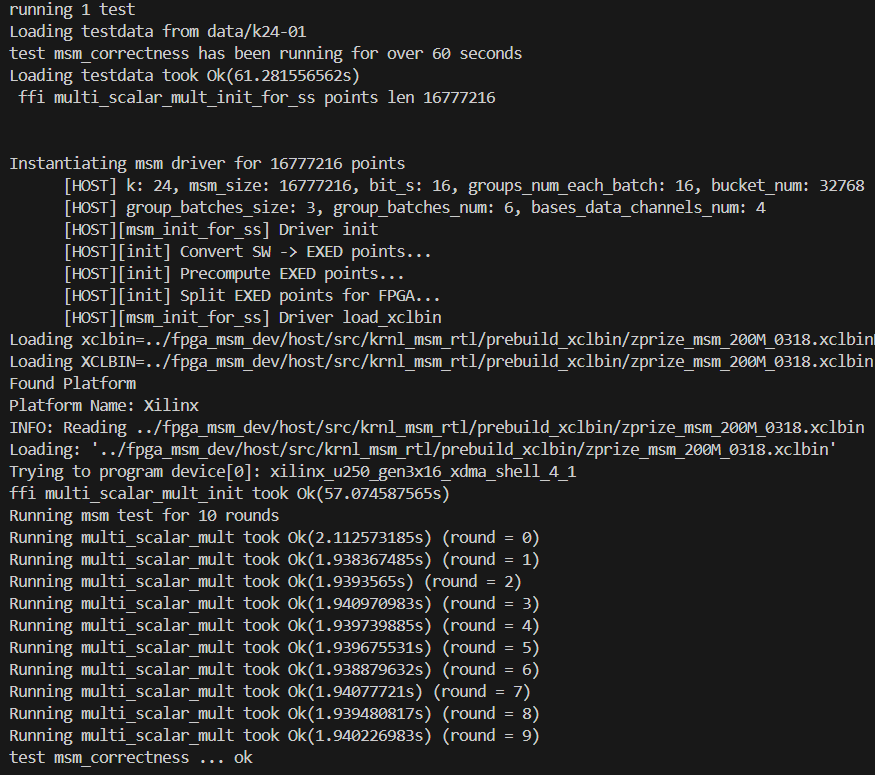
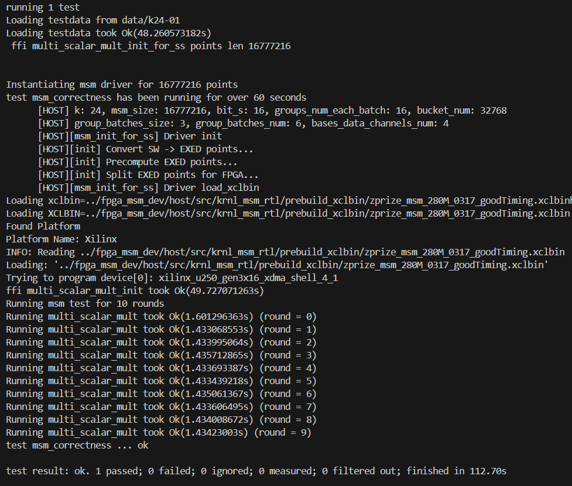

## SuperScalar_ZPrize_2023

- This repository contains the submission of SuperScalar for the ZPrize 2023 - Prize 1a competition.
- There are two folders in this repository: `fpga_msm_dev` and `test_fpga_harness_for_ss`.
- Due to time constraints, we have currently implemented FPGA-accelerated computation for BLS12-377 only.

### Execute

- In the `test_fpga_harness_for_ss` directory and use `run.sh`. Running through generating test data to execution, the process is expected to take no more than approximately one hour; please refer to`test_fpga_harness_for_ss/readme.md` for specifics.
- Hardware Version:
  - The default hardware version used is `fpga_msm_dev/host/src/krnl_msm_rtl/prebuild_xclbin/zprize_msm_200M_0318.xclbin`, which is a relatively slower variant.
  - You can modify the `test_fpga_harness_for_ss/run.sh`to leverage `fpga_msm_dev/host/src/krnl_msm_rtl/prebuild_xclbin/zprize_msm_280M_0317_goodTiming.xclbin`for enhanced performance. Please note that using the 280m hardware version will impose higher requirements on both cooling and power supply systems. To make the switch, kindly update the relevant configuration in the `run.sh`script accordingly.

### Performance Testing:

- **Test Platform:**

  - **System:** Ubuntu 22.04 LTS
  - **CPU:** AMD Ryzen 7 7800X3D with 8 Cores and 16 Threads
  - **Memory:** 192GB DDR5
  - **FPGA:** Xilinx Alveo U250 FPGA Acceleration Card
- **Testing Requirements:**

  - **Computation Time Considerations:** The calculation time does not include the preparation and transfer of point data to the FPGA; however, it does factor in the preparation and transfer of scalar data to the FPGA.
  - **Test Procedure:** Each run of the test program consists of 10 rounds, with each round comprising four MSMs at a scale of $2^{24}$.
- **Test Results:**

  - 200M_ver
    - **Fastest round Time:** Use`fpga_msm_dev/host/src/krnl_msm_rtl/prebuild_xclbin/zprize_msm_200M_0318.xclbin`.  The fastest individual round time was approximately 1.93s.
    - We have saved a log of one run in the file `test_fpga_harness_for_ss/log_run_200M_0318.txt`.
    - 
  - 280M_ver
    - **Fastest round Time:** Use`fpga_msm_dev/host/src/krnl_msm_rtl/prebuild_xclbin/zprize_msm_280M_0317_goodTiming.xclbin`.  The fastest individual round time was approximately 1.43s.
    - We have saved a log of one run in the file `test_fpga_harness_for_ss/log_run_280M_0318.txt`.
    - 

### Directory Structure:

In the `fpga_msm_dev` folder, you will find our main FPGA project, which includes compile scripts, RTL (Verilog HDL) source files, FPGA design documentation, and pre-compiled xclbin files:

- To compile, navigate to the `fpga_msm_dev/host` directory and execute `run_hw.sh`.
- To utilize our pre-compiled files, they are located at `fpga_msm_dev/host/src/krnl_msm_rtl/prebuild_xclbin/`.
- For more details, refer to `fpga_msm_dev/README.md`.

The `test_fpga_harness_for_ss` folder contains a modified test harness toolchain designed to test our Multi-Scalar Multiplication (MSM) design on the FPGA:

- The run script is `run.sh` within the `test_fpga_harness_for_ss` directory, which defaults to testing the FPGA-accelerated BLS12-377 MSM with k = 24.
- For further information, consult `test_fpga_harness_for_ss/README.md`.
