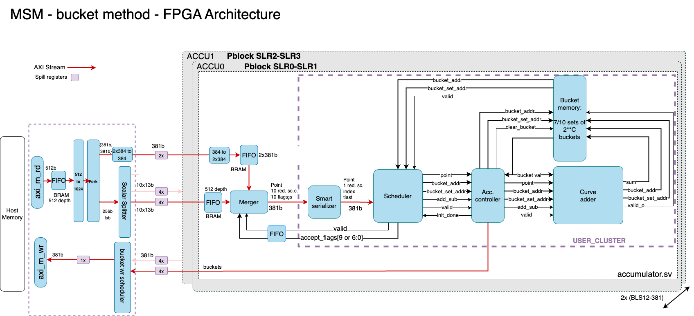

<!-- TOC start (generated with https://github.com/derlin/bitdowntoc) -->

- [MSM](#msm)
   * [The algorithm](#the-algorithm)
   * [FPGA architecture](#fpga-architecture)
      + [Scalar distribution](#scalar-distribution)
      + [Merger and Scheduler](#merger-and-scheduler)
      + [Smart Serializer](#smart-serializer)
      + [Accumulator Controller](#accumulator-controller)
      + [Bucket Memory](#bucket-memory)
      + [Curve adders](#curve-adders)
- [SW Acceleration](#sw-accel)
- [Delivery test evidence](#delivery-test-evidence-vm)

<!-- TOC end -->

<!-- TOC --><a name="Running the kernels and bench"></a>
# Running the kernels and bench
Please check [this](sw/README.md).

<!-- TOC --><a name="msm"></a>
# MSM

This README decsribes the multi-scalar multiplication (MSM) implementation on FPGAs. The first draft targets the U250.

<!-- TOC --><a name="the-algorithm"></a>
## The algorithm

We have implemented a heavily optimized version of [Pippenger's algorithm](https://dl.acm.org/doi/abs/10.1137/0209022) in order to solve the MSM problem.

We picked window size of 13 bits, which allowed for efficient mapping to FPGA URAM resources which are natively 4096 elements deep. Points are transformed and pre-loaded into DDR-4, so that at run time only scalars are sent from the host to the FPGA via PCIe. We implemented multiple fully-pipelined mixed point adders on the FPGA that add points to buckets as directed by the controller until there are no more points left. The controller automatically handles possible collisions (only accessing a bucket when it does not already have an addition in-flight). Once all points have been added into buckets, the FPGA streams back the result for the host to do the final (much smaller) triangle summation (aggregation). This approach allows us to focus on implementing a very high performance adder on the FPGA (as these additions dominate Pippenger's algorithm), and then leaving smaller tasks for the host to perform.

The above description overly simplifies the amount of optimizations and tricks we have implemented to get performance. Some of the optimizations are listed out below.

<!-- TOC --><a name="fpga-architecture"></a>
## FPGA architecture

The MSM implemenation on FPGA is constructed as displayed in the following pictures:



From left to right, full scalars and points are read from the host and converted into three streams reduced scalars each (assuming we have three-stream implementation, C=13 → ceil(256 / 13) = 20 windows → ceil(20 / 2) = 10 windows per stream). Points have forked out from the main input stream into the 2x386 (x, y) per points. Each stream feeds a full accumulator block performing bucket accumulation.

In the accumulator, the Merger creates a stream of pairs containing a point and a set of reduced scalars. The same point is used for each stream of reduced scalars per accumulators. Furthermore, both reduced scalars and points are read in order, so can be read in efficient bursts. Finally, the merger streams them out to the scheduler. The merger combines the stream of points with the stream of sets of reduced scalars and produces a stream where each transaction will contain a single point and equicalent set of reduced scalars.

The scheduler then gives feedback to the merger indicating whether a `point_with_scalars` has been accepted or not. When it is rejected due to a future pipeline conflict, the merger should be sent again at a later instance. When it is accepted, the scheduler will forward it to the curve adder pipeline and the merger can accept new data from the point and reduced scalar FIFOs. The Scheduler makes sure that no collisions happen in the curve adder by rejecting reduced scalars that are already in the pipeline. The output stream of the Scheduler is a `bucket_addr` and `bucket_set addr`, a point, a flag indicating add/subtract, and a valid indication a new set is available. These signals are accepted by the Accumulator Controller (Acc Controller).

The Accumulator Controller triggers the read from the Bucket memory and pushes the add/sub command into the curve adder. After the whole accumulation is completed, the Controller will also read out all buckets and write them back to the host memory such that the host can do the aggregation. We call this phase, bucket write phase.

The Bucket memory contains all the intermediate sums of points. In the case of BLS12-381, the Bucket memory contains a sets of 10 buckets with two accumulators) where each set has $2^{C-1}=2^{12}$ buckets.  


<!-- TOC --><a name="scalar-distribution"></a>
### Scalar distribution

The purpose of the scalar splitter is to split every full scalar into their signed reduced constituents. 256-bit scalar values are split into smaller sections of each C=13 bits wide. This results in a list of WCNT = ceil(256 / C) reduced scalars. A trick to halve the number of buckets $2^{C}$ is the conversion of these reduced scalars to signed reduced scalars: now only a sign and 12 bits are required. When the sign is positive, the point is added to the bucket addressed by the absolute value. When it is negative, it will be subtracted. 

Example, consider a small full scalar of 8 bits S=41 = 0b00101001 when C=4 bits, we get two reduced scalars 0b0010 and 0b1001. Converting the latter to signed gives -7 with carry=1. Adding the carry to the other reduced scalar results in 3 since. Combining the factors gives $3^{4} - 7 (2^0) = 41$.

<!-- TOC --><a name="merger-and-scheduler"></a>
### Merger and Scheduler

The merger combines the stream of points and reduced scalars from the host. On its output port, data will be produced in the following pattern:

{P1, RS1, RS2, ……., RS6, RS7} → {P2, RS8, RS9, ……., RS13, RS14} → {P3, RS15, RS16, ……., RS20, RS21}

For implementation, the following parts are required: A FIFO for points and a FIFO for sets of reduced scalars, a deserializer to assemble points, and a memory where each row will contain a row with {Pn, RSn*7, RSn*7+1, ….., RSn*7+6, Flags} where the flags indicate whether the corresponding reduced scalar has been accepted by the Scheduler. Furthermore, a state machine will control the initialization, normal flow of data, and finishing. Since both inputs and data output are AXI streams the statemachine should consider this as well. When the scheduler confirms it has received the point by using AXI-stream ready, the pointer increases by one, thereby making the next set of points available. Similarly, the accept pointer is increased for every data set that is either fully accepted or partially rejected by the scheduler. When it is fully accepted, the corresponding row is available for new data, and the row data should be replaced with a new point and reduced scalars from the FIFOs. When the row is (partially) rejected, the accept. ptr. is still updated to the next row, but the data remains unchanged. Additionally, the flags should be updated based on the response of the scheduler (which gives an update on all flags). 

<!-- TOC --><a name="smart-serializer"></a>
### Smart Serializer

Since the scheduler accepts a single point-red_scalar pair per clock cycle and the merger produces a tuple with 7 or 10 reduced scalars, a serializer is needed in between. This serializer sends accepts 7/10 reduced scalar at the input and sends them sequentially to the scheduler. To prevent empty cycles, this serializer should skip the reduced scalars that have already been accepted by the scheduler (marked by flags). Furthermore, the serializer should provide an index on the output with the red. scalar. such that the scheduler knows which of the 7/10 reduced scalars of a merger row should be scheduled. Furthermore, a tlast indicates whether it is the last of a row. 


<!-- TOC --><a name="accumulator-controller"></a>
### Accumulator Controller

To control the states of the MSM application, the accumulator controller is used. It is a state machine with three states. It waits for ap_start to go into the first state where all the buckets are filled with the identity element. After all buckets have been filled, normal operation can start in which points are accumulated into buckets. Finally, when all points have been accumulated, all the bucket values are retrieved from the bucket memory and forwarded to the Bucket writer. The bucket writer stores all bucket values into the host memory such that the host can aggregate them all into the final result.

The Accumulator controller communicates with four other modules. From the scheduler, a command is received which consists of a point, bucket (set) address, a flag indicating whether to add or subtract, and a valid to trigger a new command. Additionally, an init_done signal signals whether the scheduler can start sending. The top interface retrieves the bucket_value from bucket memory addressed by bucket (set) address which is present on the bucket_val signal after a few cycles. On the interface to the right, all data required to trigger a curve addition is collected and aligned by the controller. Finally, the AXI-stream link to the bucket writer sends the bucket values to the host memory.

<!-- TOC --><a name="bucket-memory"></a>
### Bucket Memory

The bucket memory acts as an intermediate storage to retrieve and store bucket values. When a point is added or subtracted from a bucket, first the current bucket value is retrieved, then the operation is performed resulting in a new value that is stored in the same bucket. Before the computation of bucket values can start, every bucket needs to be initiated with a special identity element such that the first addition to the bucket will result in the same value (analogous to adding 0 + val = val). For communication with other modules, the bucket memory has three interfaces: one interface to receive results from the curve adder for storage, another from the Acc. controller indicating which bucket to retrieve, and finally, an interface indicating to the scheduler to indicate that a bucket is free to be scheduled again.

<!-- TOC --><a name="curve-adders"></a>
### Curve adders

The curve adder BLS12-381 is implemented following the formula described in: https://hyperelliptic.org/EFD/g1p/auto-shortw-xyzz.html#addition-madd-2008-s. It requires 8 multipliers and 2 squares. Inspired by the 377 implementation the multipliers for this version also combine Karatsuba with NAF specific for BLS12-381 field.

<!-- TOC --><a name="sw-accel"></a>
# SW Acceleration

In the proof_system/widget/lookup and quotient_poly we idenfied opportunities for loop parallelization and achieved solely by this a speed-up of 5,7X.

<!-- TOC --><a name="delivery-test-evidence-vm"></a>
# Delivery test evidence
```sh
ubuntu@zprize-u250-3:~/work/zprize$ cargo bench --bench zprize_bench |& tee log-delivery-final
warning: profiles for the non root package will be ignored, specify profiles at the workspace root:
package:   /home/ubuntu/work/zprize/poly-commit/Cargo.toml
workspace: /home/ubuntu/work/zprize/Cargo.toml
warning: profiles for the non root package will be ignored, specify profiles at the workspace root:
package:   /home/ubuntu/work/zprize/ponos-engine/Cargo.toml
workspace: /home/ubuntu/work/zprize/Cargo.toml
   Compiling plonk v0.8.2 (/home/ubuntu/work/zprize)
    Finished bench [optimized] target(s) in 18.30s
     Running benches/zprize_bench.rs (target/release/deps/zprize_bench-f33cffe171d88729)
==============================
Start generating 4 proofs
Proof 0 is generated
Time elapsed: 200.120348696s
Proof 1 is generated
Time elapsed: 398.452818701s
Proof 2 is generated
Time elapsed: 596.739917446s
Proof 3 is generated
Time elapsed: 794.336476694s
The total prove generation time is 794.336480023s
Aromatized cost for each proof is 198.584120303s
==============================
Start verifying 4 proofs
Proof 0 is verified: true
Time elapsed: 103.704757ms
Proof 1 is verified: true
Time elapsed: 192.497669ms
Proof 2 is verified: true
Time elapsed: 306.078274ms
Proof 3 is verified: true
Time elapsed: 441.830193ms
The prove verification time is 441.833004ms
Aromatized cost for each proof is 110.458525ms
==============================
ubuntu@zprize-u250-3:~/work/zprize$ hostname
zprize-u250-3
ubuntu@zprize-u250-3:~/work/zprize$ date
Tue Oct  8 10:02:51 UTC 2024
```
